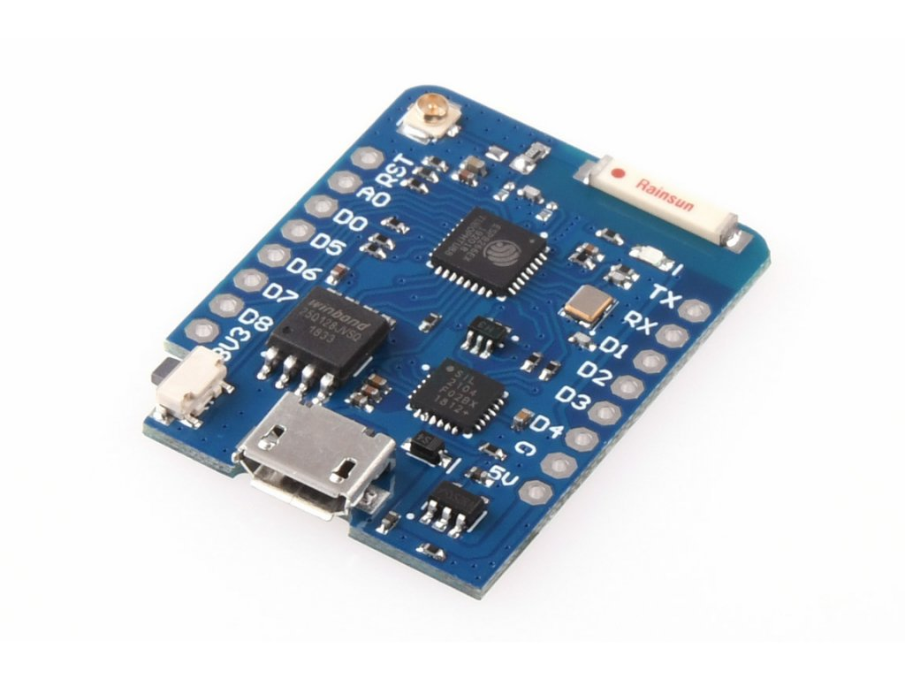

# About
This project is a modification of the [NAMF's code](https://github.com/nettigo/namf), see [the original README](OldReadme.md).

It is the code for the microcontroller Wemosa D1 mini PRO  that controls 
[Nettigo Air Monitor](https://nettigo.eu/products/nettigo-air-monitor-kit-bme-0-3-3-pro-language-en-build-your-own-smog-sensor) which consit of the NovaFitness SDS011 particulate matter sensors and the Bosch BME280 pressure, humidity, and temperature sensors.

## List of main differences
It can be easily checked with:
```bash
$ git diff NAMF-2020-46a
```
- automatic build at GitHub Pages
    available at https://tomaszpierzchala.github.io/namf/firmware-esp8266-pl.bin
- Update Over The Air 
    - from mentioned above secured page
- security changes
    - Password of WiFi access point (AP) should be at least MIN_PASSWD_LENGTH characters long, as it is the only Security Protection while conecting to AP - no more password saved in the repo. 
    - AP password, can be localy set in not commited auxiliary file `dev_secrets.ini` like :\
    \
    [common]\
    build_flags =\
        -D**WIFI_SSID**=\\"Local Wifi Router SSID/Name - predefined\\"\
        -D**WIFI_PASS**=\\"Local Wifi Router Password - predefined\\"\
        -D**AP_NAME**=\\"Access Point Name\\"\
        -D**AP_PASSWORD_MAX64_LONG**=\\"Access Point Password\\"

- src/lang/intl_\*.**h** removed from repo as their are created from intl_\*.lang files
- removed warnings for any _default_envs_ builds
    - I removed the ambiguity in the selection of the `sensirion_hw_i2c_implementation.cpp` library method forcing (int) cast `Wire.requestFrom((int) address, (int) count);` with help of `fix_wire.py`
- updates in PlatormIO file (`platformio.ini`)
- other
    - _I am going to revert it - I will add APFS (case-sensitive volume)_ -
 Due to the overlap of file names on Mac OS when they differ only in letter case, I changed the ambiguous names by adding the prefix `local` at `src/`:
        - update.h -> localUpdate.h
        - wbserver.cpp -> localWebserver.cpp
        - webserver.h -> localWebserver.h
        - wifi.cpp -> localWifi.cpp
        - wifi.h -> localWifi.h

## Acknowledgments
Special thanks to [ChatGPT](https://chat.openai.com/) for helping me debug and improve the ESP8266 C++ code 🚀  
Thank you as well for the valuable, intelligent, and educational conversations – and for the patience along the way 😉
